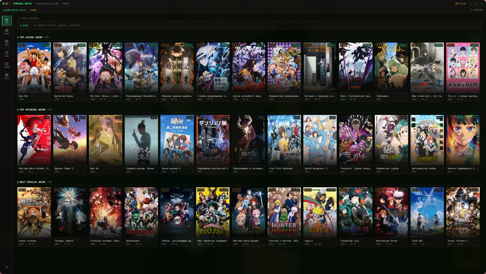
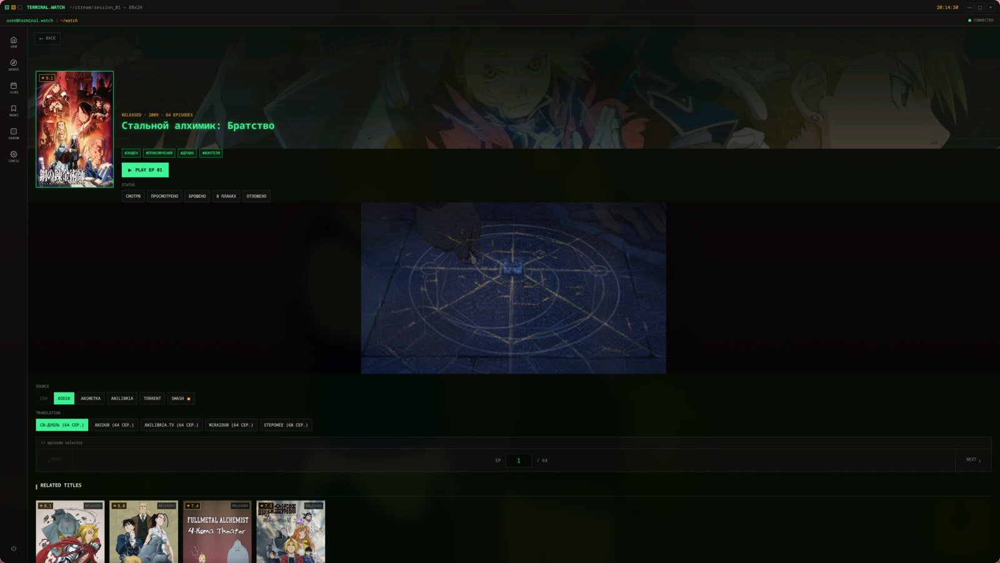
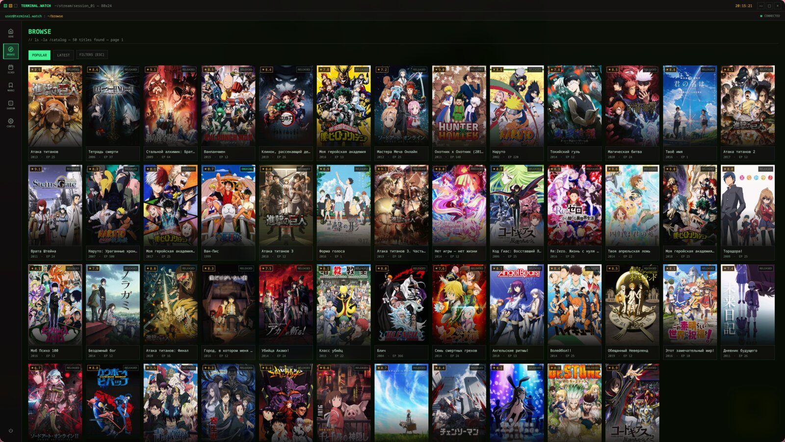
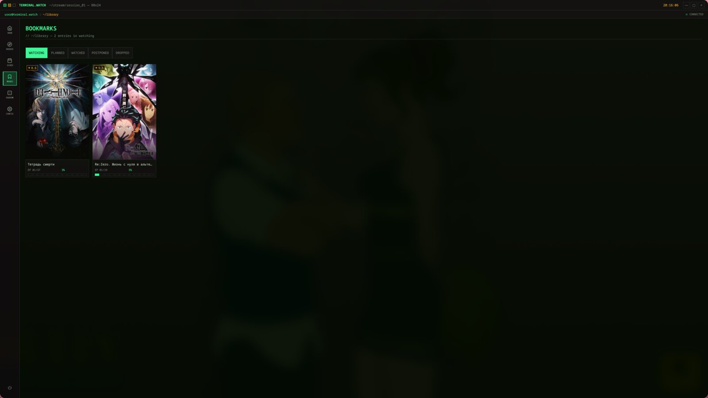

# KuroMoe Veil

Десктопный клиент аниме на **C++20 + Qt 6 (QML) + libmpv**.

Каталог — Shikimori, озвучки — Kodik / AnimeGO / AniLibria, торренты — JacRed + TorrServer.

## Скриншоты

Главная:



Карточка тайтла и плеер:



Каталог:



Закладки:



## Сборка

Зависимости: CMake ≥ 3.21, **три** модуля Qt 6 (не весь Qt) и libmpv.

| Нужно | Зачем |
|--------|--------|
| **qtbase** | Core, Gui, Network, Sql/SQLite, OpenGL, Concurrent |
| **qtdeclarative** | Qml, Quick, Quick Controls |
| **qtsvg** | иконки SVG + `gen_icon` |

Не ставь `qt`, `qt6` целиком, `qtwebengine`, `qtmultimedia` — они не линкуются.

**Arch / CachyOS**

```bash
sudo pacman -S --needed cmake ninja pkgconf qt6-base qt6-declarative qt6-svg mpv
cmake -S . -B build
cmake --build build --target anime_client_cpp
./build/anime_client_cpp
```

**Debian / Ubuntu**

```bash
sudo apt install cmake ninja-build pkg-config \
  qt6-base-dev qt6-declarative-dev libqt6svg6-dev libmpv-dev
```

**Windows (vcpkg, только эти порты)**

```bat
vcpkg install --triplet x64-windows
```

Манифест `vcpkg.json` тянет `qtbase` + `qtdeclarative` + `qtsvg`. libmpv отдельно: готовая dev-сборка в `C:/dev/libmpv` (shinchiro).

Подробности — в [docs/MANUAL.md](docs/MANUAL.md).

## Настройки

В приложении (и в `config.ini`):

| Ключ | Зачем |
|------|--------|
| JacRed URL | Поиск торрентов, по умолчанию `https://jac.red` |
| Kodik token | Публичный токен вшит в код. Свой — только если дефолт перестал работать |
| Прокси | SOCKS5/HTTP для Kodik / AnimeGO, если геоблок |

Образец без личных данных: `packaging/config.ini.example`.

## Что не коммитить

Сборки (`build/`, `dist/`), логи, `terminals/`, живой `config.ini` с прокси.
