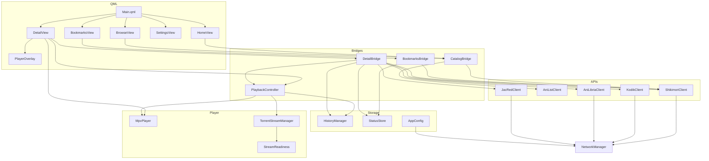

# KuroMoe Veil — полный мануал разработчика

**Проект:** `C:\Users\eblan\Documents\anime_client_cpp`  
**Бинарник:** `anime_client_cpp.exe`  
**UI-название:** KuroMoe Veil  
**Стек:** C++20, Qt 6 (QML), libmpv, SQLite  
**Обновлено:** 2026-06-29

Этот документ — «огромный мануал»: что где лежит, как связано, как течёт данные, как собирать, отлаживать и отдавать другу. Журнал последних правок — в `docs/PROGRESS.md`.

---

## Содержание

1. [Что это за приложение](#1-что-это-за-приложение)
2. [Быстрый старт](#2-быстрый-старт)
3. [Структура папок](#3-структура-папок)
4. [Сборка и деплой Qt](#4-сборка-и-деплой-qt)
5. [Общая архитектура](#5-общая-архитектура)
6. [Точка входа: main.cpp](#6-точка-входа-maincpp)
7. [C++ ядро — все модули](#7-c-ядро--все-модули)
8. [QML интерфейс](#8-qml-интерфейс)
9. [Навигация и экраны](#9-навигация-и-экраны)
10. [Потоки данных end-to-end](#10-потоки-данных-end-to-end)
11. [Внешние API](#11-внешние-api)
12. [Настройки и config.ini](#12-настройки-и-configini)
13. [Сеть и прокси](#13-сеть-и-прокси)
14. [Плеер: mpv, торренты, автопереход](#14-плеер-mpv-торренты-автопереход)
15. [База данных SQLite](#15-база-данных-sqlite)
16. [Постеры и изображения](#16-постеры-и-изображения)
17. [Кастомный title bar](#17-кастомный-title-bar)
18. [Инструменты tools/](#18-инструменты-tools)
19. [Упаковка для друга](#19-упаковка-для-друга)
20. [Отладка и типичные проблемы](#20-отладка-и-типичные-проблемы)
21. [Шпаргалки](#21-шпаргалки)

---

## 1. Что это за приложение

**KuroMoe Veil** — десктопный Windows-клиент для просмотра аниме. Порт Python/Qt-версии: QML-экраны и «мосты» (Bridge) сохранили те же роли, что `catalog_bridge.py`, `detail_bridge.py` и т.д.

### Возможности

| Функция | Как реализовано |
|---------|-----------------|
| Каталог, поиск, фильтры | Shikimori GraphQL через `CatalogBridge` |
| Популярное / новое / онгоинг / календарь | `BrowseView` + `ShikimoriClient` |
| Hero-баннер «продолжить» | История + Shikimori + баннеры AniList |
| Карточка тайтла | `DetailView` + `DetailBridge` |
| Озвучки Kodik | `KodikClient`, HLS, **через прокси** |
| Официальные релизы AniLibria | `AniLibriaClient`, HLS без прокси |
| Торренты | Поиск JacRed + TorrServer + libmpv |
| Закладки по статусу | `StatusStore` + `BookmarksBridge` |
| История просмотра | `HistoryManager`, SQLite |
| Встроенный плеер | `MpvPlayer` + `PlayerOverlay` (uosc-style) |
| Настройки | Прокси, TorrServer, рендер, FPS, JacRed URL |

### Паттерн кода

```
QML View  →  C++ Bridge  →  API Client / Player / SQLite
                ↑
         Context properties (appConfig, historyManager, Theme, posterCache)
```

---

## 2. Быстрый старт

### Сборка

```bat
cmake --build build --config Debug --target anime_client_cpp
cmake --build build --config Release --target anime_client_cpp
```

### Запуск (разработка)

```bat
run-debug.bat
```

| Что | Где |
|-----|-----|
| Exe Debug | `build\Debug\anime_client_cpp.exe` |
| Exe Release | `build\Release\anime_client_cpp.exe` |
| Лог | `build\Debug\anime_client.log` (рядом с exe) |
| Остановить процесс | `stop-app.bat` |

### Зависимости

- **Qt 6** — только `qtbase` + `qtdeclarative` + `qtsvg` (`vcpkg.json`). Не ставить метапакет `qt`.
- **libmpv** — **не** из vcpkg; готовая сборка `C:/dev/libmpv` (shinchiro mpv-dev-x86_64)
- **CMake** ≥ 3.21, **MSVC**, C++20

### Важно

- Не собирать из папки `anime_client_cpp — копия` — устаревшая копия.
- QML вшивается в exe при сборке — **без пересборки изменения QML не появятся**.
- Перед сборкой закрыть `anime_client_cpp.exe` (иначе LNK1168).

---

## 3. Структура папок

```
anime_client_cpp/
├── CMakeLists.txt           # Сборка, QML-модуль, ручной деплой Qt-плагинов
├── package-share.ps1        # Упаковка portable-сборки для друга
├── run-debug.bat            # Запуск Debug с проверкой plugins
├── stop-app.bat
│
├── src/
│   ├── main.cpp             # Entry, QML engine, регистрация типов
│   └── core/                # Вся бизнес-логика (22 пары .h/.cpp + Theme.h)
│
├── qml/
│   ├── Main.qml             # Корневое окно
│   ├── HomeView.qml         # Главная: каталог + hero
│   ├── BrowseView.qml       # Обзор: популярное/новое/онгоинг/календарь
│   ├── BookmarksView.qml    # Закладки по статусу
│   ├── SettingsView.qml     # Настройки
│   ├── DetailView.qml       # Страница тайтла + плеер
│   ├── components/          # Переиспользуемые виджеты
│   └── assets/              # SVG/PNG: навигация, плеер, окно, лого
│
├── resources/
│   ├── app.rc               # Windows: иконка exe + version info
│   ├── app.ico / app.png    # Генерируются gen_icon из logo.svg
│   └── qt.conf              # Plugins = plugins (portable)
│
├── tools/
│   ├── gen_icon.cpp         # SVG → PNG + ICO (сборка)
│   └── *.py                 # Отладка Kodik (не в релиз)
│
├── packaging/
│   ├── config.ini           # Чистый конфиг для друга (без прокси)
│   ├── config.ini.example
│   ├── README.txt
│   └── Start.bat            # Лаунчер
│
├── docs/
│   ├── MANUAL.md            # Этот файл
│   └── PROGRESS.md          # Журнал изменений
│
├── build/                   # Основная папка сборки
│   ├── Debug/
│   └── Release/
└── dist/
    ├── KuroMoe_Veil/        # Portable-папка
    └── KuroMoe_Veil-win64.zip
```

---

## 4. Сборка и деплой Qt

### CMake: что делает особенного

`qt_add_executable` + `qt_add_qml_module` вшивают QML в ресурсы. **Автодеплой Qt копирует только «плоские» DLL** — остальное CMake дописывает в `POST_BUILD`:

| Артефакт | Зачем |
|----------|-------|
| `libmpv-2.dll` | Рантайм mpv |
| `platforms/qwindows[d].dll` | **Без этого — «no Qt platform plugin»** |
| `plugins/platforms/qwindows[d].dll` | Для `qt.conf` → `Plugins = plugins` |
| `sqldrivers/qsqlite[d].dll` + `sqlite3.dll` | HistoryManager, StatusStore |
| `tls/qschannelbackend[d].dll` | HTTPS (Shikimori, Kodik…) |
| `imageformats/*.dll` + `jpeg62.dll` | JPEG-постеры |
| `qml/QtQuick/…` | QtQuick.Controls в рантайме |
| Extra: QuickControls2, Templates2, Basic, Svg… | Цепочка QML-плагинов |
| `qt.conf` | Portable-пути к плагинам |

Debug vs Release: CMake подставляет `*d.dll` или release-варианты через `$<CONFIG:Debug>`.

### gen_icon (утилита сборки)

```
qml/assets/logo.svg
       ↓ gen_icon.exe (CMake target app_icons)
resources/app.png, resources/app.ico, qml/assets/app.png
       ↓
resources/app.rc → иконка в exe
```

**Не запускать `gen_icon.exe` вручную** — это не приложение. Ошибка «no Qt platform plugin» с заголовком `gen_icon` = случайный клик по утилите сборки.

### Переменные окружения (main.cpp принудительно чистит)

| Переменная | Проблема если задана |
|------------|----------------------|
| `QT_QPA_PLATFORM=offscreen` | Нет platform plugin |
| `QT_PLUGIN_PATH` | Ломает поиск `qwindows.dll` |
| `QT_FATAL_WARNINGS` | Abort на любом QML Warning |

Принудительно: `QT_QUICK_CONTROLS_STYLE=Basic` — задеплоен только Basic-стиль.

---

## 5. Общая архитектура



### Слои ответственности

| Слой | Отвечает за | Не отвечает за |
|------|-------------|----------------|
| **QML** | Отображение, жесты, навигация | HTTP, парсинг API |
| **Bridge** | Оркестрация, сигналы в QML | Прямой рендер видео |
| **Client** | Один внешний сервис | UI-состояние |
| **PlaybackController** | Единое состояние воспроизведения | Поиск торрентов |
| **MpvPlayer** | libmpv, дорожки, FBO | Выбор URL озвучки |

---

## 6. Точка входа: main.cpp

Файл: `src/main.cpp`

### Порядок инициализации (критичен)

1. `qputenv("QT_QUICK_CONTROLS_STYLE", "Basic")`
2. Сброс `QT_QPA_PLATFORM`, `QT_PLUGIN_PATH`, `QT_FATAL_WARNINGS`
3. `setOrganizationName("AnimeClient")`, `setApplicationName("AnimeClientCpp")`
4. `QQuickWindow::setGraphicsApi(OpenGL)` — нужно для `MpvPlayer` (FBO)
5. **`addLibraryPath(appDir)` и `addLibraryPath(appDir/plugins)` ДО `QGuiApplication`**
6. `QGuiApplication app`
7. Иконка окна: exe → `:/qt/qml/AnimeClient/qml/assets/app.png`
8. `setlocale(LC_NUMERIC, "C")` — libmpv требует
9. Лог в `anime_client.log` рядом с exe
10. Регистрация QML-типов (`MpvPlayer`, `PlaybackController`, bridges…)
11. `engine.addImportPath(":/")` и `engine.addImportPath(appDir + "/qml")`
12. Context properties: `appConfig`, `historyManager`, `posterCache`, `Theme`
13. `engine.loadFromModule("AnimeClient", "Main")`

### CLI-флаги (отладка)

| Флаг | Действие |
|------|----------|
| `--auto-browse` | Через 2 с переключить на вкладку Browse |
| `--auto-calendar` | Через 2.5 с открыть календарь |

### Debug-особенность

После `app.exec()` — обычный `return`. Синглтоны parent'ятся к `qApp`, чтобы не умирать после `QGuiApplication`.

---

## 7. C++ ядро — все модули

Все файлы в `src/core/`, перечислены в `CMakeLists.txt`.

### AppConfig (`AppConfig.h/.cpp`)

**Роль:** синглтон настроек, QML-свойство `appConfig`.

**Где лежит config.ini:**

```
1. <папка_exe>/config.ini  — если файл СУЩЕСТВУЕТ → portable (сборка для друга)
2. %APPDATA%\AnimeClient\AnimeClientCpp\config.ini  — иначе (разработка)
```

> **У тебя лично** может ещё лежать старый файл `%APPDATA%\AnimeClient\config.ini` от ранней версии (Python / старый QSettings). Текущий код его **не читает**, если нет portable `config.ini` рядом с exe — он смотрит в `AnimeClientCpp\`.

**Ключи INI:**

```ini
[player]
mpvPath=
volume=80
renderMode=auto      # auto | gpu | software
fpsLimit=auto        # auto | unlimited | 120 | 60 | 30

[torrent]
serverPath=          # путь к TorrServer-windows-amd64.exe

[proxy]
enabled=false
type=http            # http | socks5
host=
port=0
user=
password=

[catalog]
excludeChinese=false
jacredUrl=https://jac.red

[kodik]
token=               # кэшируется после первого fetch

[ui]
theme=retro          # по умолчанию retro; "dark" — старая тема
```

**Методы:** `mpvProxyUrl()`, `autoDetectTorrServer()`, `historyDbPath()`.

---

### NetworkManager (`NetworkManager.h/.cpp`)

**Роль:** единая HTTP-точка, два менеджера:

| Менеджер | Прокси | Кто использует |
|----------|--------|----------------|
| `m_namExternal` | Из AppConfig | Kodik, AniLibria, AniList |
| `m_namLocal` | Всегда NoProxy | Shikimori, JacRed, TorrServer, постеры |

**API:**
- `get()` / `post()` — external
- `getLocal()` / `postLocal()` — без прокси

Дисковый кэш 64 МБ на каждый менеджер. При `AppConfig::proxyChanged` → `refreshProxy()`.

---

### ShikimoriClient (`ShikimoriClient.h/.cpp`)

**Роль:** основной каталог и метаданные.

| Endpoint | Назначение |
|----------|------------|
| `https://shikimori.io/api/graphql` | Поиск, каталог, детали, related, getByIds |
| `https://shikimori.io/api/calendar` | Календарь релизов |

- **Прокси:** нет (`postLocal`, `getLocal`)
- **Rate limit:** очередь GraphQL ~420 мс, retry на 429
- **`bestPosterUrl()`:** предпочитает JPEG (Qt без webp в деплое)
- **`isChinese()`:** фильтр китайских тайтлов (`excludeChinese`)

Нормализованный item: `id`, `title`, `originalTitle`, `englishTitle`, `japaneseTitle`, `malId`, `poster`, `posterHd`, `kind`, `episodes`, `score`, `genres`, `studios`, `description`…

---

### AniListClient (`AniListClient.h/.cpp`)

**Роль:** только широкие hero-баннеры.

- `https://graphql.anilist.co`
- Поиск по `malId`, fallback — текст
- Пропускает `.webp` баннеры

---

### KodikClient (`KodikClient.h/.cpp`)

**Роль:** озвучки и HLS-потоки. Порт Python `video_source.py` / `KodikParser`.

**Цепочка:**
1. Токен из GitHub `kdk_tokns/tokens.json` → кэш в `kodik/token`
2. API `kodik-api.com` / `kodikdb.com`
3. Парсинг HTML embed → расшифровка ссылки
4. HLS URL → mpv

- **Прокси:** да (`get`/`post` external) — геоблок
- **Ключ:** `shikimori_id`
- **Методы:** `loadTranslations()`, `getEpisodeStream()`

---

### AniLibriaClient (`AniLibriaClient.h/.cpp`)

**Роль:** официальные релизы AniLibria (подмножество каталога).

- Base: `https://anilibria.top/api/v1`
- `findRelease()` — матч по названию + kind + year
- `getEpisodes()`, `getEpisodeStream()`, `getTorrents()`
- Использует external manager (может идти через прокси, обычно не нужен)

---

### JacRedClient (`JacRedClient.h/.cpp`)

**Роль:** агрегатор торрентов (Jackett-совместимый API).

```
GET {jacredUrl}/api/v2.0/indexers/all/results?Query={title}
```

- Default URL: `https://jac.red` (если `jacredUrl` пуст)
- **Прокси:** нет (`getLocal`) — через прокси часто пустые ответы
- Сортировка по сидам; сетевая ошибка → пустой список (не fatal)
- `humanSize()` — форматирование размера

---

### CatalogBridge (`CatalogBridge.h/.cpp`)

**Роль:** мост для Home/Browse. Порт `catalog_bridge.py`.

**Сигналы:** `resultsReady`, `heroReady`, `calendarReady`, `randomReady`, `error`, `loadingChanged`, пагинация.

**Hero-поток:**
```
HistoryManager.mostRecent() или activeTitleId
  → ShikimoriClient.getDetails()
  → AniListClient.enrichHeroBanners()
  → heroReady(item с heroBanner, heroSlides)
```

---

### DetailBridge (`DetailBridge.h/.cpp`)

**Роль:** оркестратор экрана тайтла. Порт `detail_bridge.py`.

**Владеет:** Shikimori, AniLibria, AniList, JacRed, Kodik + делегирует playback в `PlaybackController`.

**При `load(item)`:**
- Kodik → `translationsReady`
- AniLibria → `anilibriaReady`, `anilibriaEpisodesReady`
- JacRed (multi-query) + AniLibria torrents → `torrentsReady`
- Shikimori details/related → `detailsReady`, `relatedReady`
- History → `progressReady`
- `PlaybackController.openTitle()` → `resumeAvailable`

**Поиск торрентов (JacRed):**
1. `buildJacredQueries()` — русское, английское, японское название
2. Последовательные запросы с ранней остановкой
3. `filterJacredResults()` — год, kind (`matchesYear`, `matchesKind`)
4. `rankTorrentResults()` — релевантность, франшиза, версия
5. Исключение украинских релизов (эвристики в коде)
6. Merge с торрентами AniLibria

**`play(episode, translationId)`:**

| translationId | Маршрут |
|---------------|---------|
| `"torrent"` | `playTorrentEpisode(magnet, ep)` |
| `"anilibria"` | AniLibria HLS, `useProxy=false` |
| иначе (id озвучки Kodik) | `getEpisodeStream()` → `playDirectUrl(..., useProxy=true)` |

---

### BookmarksBridge (`BookmarksBridge.h/.cpp`)

```
StatusStore.listByStatus(status)
  → ShikimoriClient.getByIds(ids)
  → merge постеров/метаданных
  → resultsReady
```

---

### StatusStore (`StatusStore.h/.cpp`)

Таблица `anime_status` в том же `history.sqlite3`.

| Поле | Назначение |
|------|------------|
| `shikimori_id` | PK |
| `title`, `poster` | Кэш для UI |
| `status` | watching / planned / watched / postponed / dropped |
| `torrent_magnet` | Последний выбранный magnet |

При статусе `watched` торрент сбрасывается.

---

### HistoryManager (`HistoryManager.h/.cpp`)

Синглтон `historyManager` в QML.

Таблица `watch_progress`:

| Колонка | Смысл |
|---------|-------|
| `title_id` | Shikimori ID |
| `episode` | Номер серии |
| `position_seconds` | Позиция |
| `translation_id` | kodik / anilibria / torrent |
| `updated_at` | Время |

`reportPosition()` — flush каждые **5 секунд**. `mostRecent()` — для hero «продолжить».

---

### EpisodeParser (`EpisodeParser.h/.cpp`)

`pickEpisodeIndex(files, episode)` — номер серии из имён файлов торрента (regex + fallback по порядку).

---

### StreamReadiness (`StreamReadiness.h/.cpp`)

Проверка HTTP перед передачей URL в mpv:

- `Local` — TorrServer (без прокси)
- `External` — Kodik (с прокси)

По умолчанию: 60 попыток × 500 мс.

---

### TorrentStreamManager (`TorrentStreamManager.h/.cpp`)

**TorrServer:** `http://127.0.0.1:8090`

**Пайплайн:**
1. `ensureServerRunning()` — запуск `TorrServer-windows-amd64.exe` из настроек или Downloads
2. POST `/torrents` — add magnet
3. Poll до готовности файлов
4. `EpisodeParser.pickEpisodeIndex`
5. URL стрима `http://127.0.0.1:8090/...`
6. `StreamReadiness::waitUntilReady(Local)`
7. Signal `streamReady`

При HTTP 404 — авто re-add magnet. `shutdownServer()` при уничтожении.

---

### MpvPlayer (`MpvPlayer.h/.cpp`)

`QQuickFramebufferObject` + libmpv.

| Аспект | Детали |
|--------|--------|
| Рендер | OpenGL FBO, fallback на software |
| Настройки | `playerRenderMode`, `playerFpsLimit` из AppConfig |
| Прокси | `playUrl(url, title, proxyUrl)` → mpv `http-proxy` |
| Дорожки | `m_preferredAudioTitle` сохраняется между сериями |
| QML | `AnimeClient.MpvPlayer`, алиас `Mpv.MpvVideo` |

Требует `LC_NUMERIC=C` и OpenGL scene graph.

---

### PlaybackController (`PlaybackController.h/.cpp`)

Единый источник правды о воспроизведении.

**Ключевые методы:**
- `openTitle()` → `resumeAvailable`
- `playDirectUrl(url, episode, useProxy)`
- `playTorrentEpisode(magnet, episode)`
- `onPlayerPosition` → HistoryManager

**Сигналы:**
- `nextEpisodeNeeded` — для Kodik/AniLibria (DetailView вызывает `bridge.play(next)`)
- `errorOccurred`, `bufferingChanged`

Торренты: автопереход на следующую серию в том же magnet. Direct: через `nextEpisodeNeeded`.

---

### PosterCache (`PosterCache.h/.cpp`)

QML: `posterCache`.

- Скачивает `https://` постеры на диск (`CacheLocation/posters`)
- Очередь: 4 параллельно, high-priority для hero
- `preloadCatalog(items)` при каждом `resultsReady`
- Эмитит `file://` через `posterReady`

Использует `getLocal` (постеры Shikimori — без прокси).

---

### PosterThumbnail (`PosterThumbnail.h/.cpp`)

`QQuickPaintedItem` для карточек каталога.

Зачем: QML `Image` в MSVC Debug давал abort при быстрой смене вкладок. Async decode через `QtConcurrent`. При `posterActive=false` картинка **остаётся в памяти** — мгновенный возврат на вкладку.

---

### PosterImageProvider (`PosterImageProvider.h/.cpp`)

`image://posters/` — зарегистрирован в main.cpp. В каталоге в основном заменён на PosterThumbnail + PosterCache.

---

### Theme (`Theme.h`)

Статический QObject как context property `Theme`. Цвета/отступы 1:1 из Python `theme.py`. Используется во всех QML: `Theme.bgApp`, `Theme.textPrimary`, `Theme.cornerPill`…

---

## 8. QML интерфейс

### Модуль

- URI: `AnimeClient` v1.0
- Entry: `loadFromModule("AnimeClient", "Main")`
- Ресурсы: `:/AnimeClient/…`, `:/qt/qml/AnimeClient/…`

### Views

| Файл | Назначение |
|------|------------|
| `Main.qml` | `ApplicationWindow`, frameless, splash, StackView, нижняя nav |
| `HomeView.qml` | Каталог, hero, поиск, фильтры жанр/год |
| `BrowseView.qml` | Вкладки: popular / latest / ongoing / calendar |
| `BookmarksView.qml` | Статусы: смотрю / в планах / просмотрено… |
| `SettingsView.qml` | Прокси, TorrServer, render/FPS, JacRed URL |
| `DetailView.qml` | Метаданные, вкладки источников, player host |

### Components (`qml/components/`)

| Компонент | Роль |
|-----------|------|
| `Card.qml` | Карточка каталога + `PosterThumbnail` |
| `CatalogGrid.qml` | `GridView`, `cacheBuffer: 800` |
| `HeroBanner.qml` | Широкий баннер — QML `Image` (не PosterThumbnail) |
| `PlayerOverlay.qml` | uosc-style UI поверх видео |
| `UoscTimeline.qml` | Таймлайн, seek |
| `UoscButton.qml` | Кнопки плеера (SVG) |
| `TitleBar.qml` | Кастомный заголовок окна |
| `TitleBarButton.qml` | min / max / close |
| `SplashScreen.qml` | Заставка при старте |
| `NavButton.qml`, `PillButton.qml` | Нижняя pill-навигация |
| `StatusPill.qml` | Статус тайтла на Detail |
| `Calendar*.qml` | Виджеты календаря |
| `PageNavRow.qml` | Пагинация каталога |

### Зарегистрированные типы (создаются в QML)

```qml
CatalogBridge { id: bridge }
DetailBridge { id: bridge; playback: playback }
PlaybackController { id: playback }
MpvPlayer { id: player }
PosterThumbnail { … }
```

---

## 9. Навигация и экраны

```
Main.qml
├── StackView
│   ├── [depth=1] tabHost — 4 вкладки в tabStrip (slide 220ms)
│   │   ├── [0] HomeView
│   │   ├── [1] BrowseView
│   │   ├── [2] BookmarksView
│   │   └── [3] SettingsView
│   └── push → DetailView (клик по карточке)
├── TitleBar (скрыт в cinemaMode)
├── bottom pill nav (скрыт в splash / cinema / detail depth>1)
└── SplashScreen (мин 1.4s + данные или таймаут 9s)
```

**Fullscreen:** `DetailView.cinemaMode` → `Main.cinemaActive` → `Window.FullScreen`.  
**Не отдельное Window** — иначе ломается GL-контекст mpv.

**Мышь:** back/forward — pop Detail или пагинация каталога.

**Предзагрузка при старте:**
- Browse `ensureLoaded()` — 400 ms
- Bookmarks `ensureLoaded()` — 1200 ms
- `warmPosters` на закладках в фоне

---

## 10. Потоки данных end-to-end

### Каталог (Home)

```
HomeView.onCompleted / search / filter
  → CatalogBridge.loadPopular / search / …
    → ShikimoriClient (GraphQL queue)
      → resultsReady(items)
        → CatalogGrid → Card → PosterThumbnail
        → posterCache.preloadCatalog(items)
```

### Hero

```
CatalogBridge.loadHero()
  → HistoryManager.mostRecent()
  → ShikimoriClient.getDetails()
  → AniListClient.enrichHeroBanners()
  → heroReady → HeroBanner.qml (QML Image, PreserveAspectCrop)
```

### Detail + воспроизведение

```
DetailView: bridge.load(item)
  ├─ translations (Kodik)
  ├─ anilibria + episodes
  ├─ torrents (JacRed + AniLibria)
  ├─ details + related (Shikimori)
  └─ progress + resumeAvailable

Пользователь жмёт Play:
  bridge.play(ep, translationId)
    ├─ torrent → TorrServer → MpvPlayer
    ├─ anilibria → HLS direct
    └─ kodik → HLS + proxy

Во время просмотра:
  MpvPlayer.position → PlaybackController → HistoryManager (каждые 5s)

Конец файла:
  torrent: авто next ep
  kodik/anilibria: nextEpisodeNeeded → DetailView → bridge.play(next)
```

### Закладки

```
BookmarksView.ensureLoaded()
  → BookmarksBridge.loadStatus("watching")
    → StatusStore (SQLite)
    → ShikimoriClient.getByIds()
    → resultsReady + preloadCatalog
```

---

## 11. Внешние API

### Сводная таблица

| Сервис | Файл | Прокси | Для чего |
|--------|------|--------|----------|
| Shikimori | `ShikimoriClient` | Нет | Каталог, детали, календарь, закладки |
| AniList | `AniListClient` | Да* | Hero-баннеры |
| Kodik | `KodikClient` | **Да** | Озвучки, стримы |
| AniLibria | `AniLibriaClient` | Да* | Официальные релизы |
| JacRed | `JacRedClient` | **Нет** | Поиск торрентов |
| TorrServer | `TorrentStreamManager` | Нет | localhost:8090 |

\*Идут через external manager; на практике часто работают и без прокси.

### JacRed — что оставили в сборке для друга

В `packaging/config.ini`:
```ini
[catalog]
jacredUrl=https://jac.red
```

В коде (`JacRedClient.cpp`): если URL пуст → fallback `https://jac.red`.

---

## 12. Настройки и config.ini

### Два режима

| Режим | Когда | Путь config.ini |
|-------|-------|-------------------|
| **Portable** | `config.ini` лежит рядом с exe | `<exe_dir>\config.ini` |
| **Разработка** | Нет portable файла | `%APPDATA%\AnimeClient\AnimeClientCpp\config.ini` |

### Что НЕ в config.ini (всегда AppData)

| Данные | Путь |
|--------|------|
| История + закладки | `%APPDATA%\AnimeClient\AnimeClientCpp\history.sqlite3` |
| HTTP-кэш | AppData cache `http/` |
| Кэш постеров | AppData cache `posters/` |
| Лог | `<exe_dir>\anime_client.log` |

### Прокси в UI (`SettingsView.qml`)

- Switch `proxyEnabled`
- type, host, port, user, password
- Строка превью: `mpv: …` через `appConfig.mpvProxyUrl()`

### Миграция со старого конфига

Старый путь: `%APPDATA%\AnimeClient\config.ini` (организация AnimeClient, файл «config»).  
Новый код читает `AnimeClientCpp\config.ini`. Если прокси «пропал» при запуске из `build\` — проверь, откуда читается конфиг. Portable-сборка для друга всегда использует свой чистый `config.ini`.

---

## 13. Сеть и прокси

```
                    NetworkManager
                          │
          ┌───────────────┴───────────────┐
          ▼                               ▼
   m_namExternal                    m_namLocal
   (+ proxy если enabled)           (NoProxy всегда)
          │                               │
   Kodik, AniLibria, AniList        Shikimori, JacRed,
                                    TorrServer, постеры
```

**Логика `proxyEnabled`:**
1. Если в INI есть `proxy/enabled` → его значение
2. Иначе: включён, если `host` не пуст и `port > 0` (миграция с Python)

**mpv:** прокси передаётся только при `playDirectUrl(..., useProxy=true)` (Kodik).

**JacRed:** намеренно `getLocal` — комментарий в коде: через прокси запросы «падают в пустоту».

---

## 14. Плеер: mpv, торренты, автопереход

### Слои в DetailView

```
DetailView
├── DetailBridge.play()
├── PlaybackController
│   ├── TorrentStreamManager
│   └── StreamReadiness
├── MpvPlayer (QQuickFBO)
└── PlayerOverlay.qml
```

### PlayerOverlay — слои (z)

| z | Элемент |
|---|---------|
| 1 | MouseArea (клик, double-click, колесо) |
| 3–4 | topBar, volumeBar, bottomChrome, timeline |
| 9 | episodeListZone (бургер-список серий) |
| 11 | trackPickerLayer (озвучка/субтитры по центру) |
| 10+ | flash-индикаторы (пауза, громкость, seek…) |

### Жесты

| Действие | Эффект |
|----------|--------|
| Колесо | Громкость |
| Shift+колесо | ±10 с |
| Двойной ЛКМ | Fullscreen (`cinemaMode`) |
| Одиночный ЛКМ | Play/pause (задержка 65 ms) |
| Правый клик | Закрепить UI (`uiPinned`) |

### Нижняя панель контролов

| Зона | Содержимое |
|------|------------|
| Слева | Бургер серий + название + время |
| Центр | ‹ play/pause › |
| Справа | −10, +10, озвучка, субтитры, скорость, fullscreen |

---

## 15. База данных SQLite

**Файл:** `%APPDATA%\AnimeClient\AnimeClientCpp\history.sqlite3`

### watch_progress (HistoryManager)

Прогресс просмотра по `title_id` (Shikimori).

### anime_status (StatusStore)

Статусы закладок + последний magnet.

**Требует деплоя:** `sqldrivers/qsqlite.dll` + `sqlite3.dll` рядом с exe.

---

## 16. Постеры и изображения

| Компонент | Где | Как |
|-----------|-----|-----|
| `PosterCache` | Каталог, закладки | Диск, async queue |
| `PosterThumbnail` | `Card.qml` | PaintedItem, QtConcurrent |
| `HeroBanner` | Home hero | QML Image, AniList `.jpg` |
| WebP | — | Fallback на JPEG; warning без `qwebp` |

**Сетка:** `GridView` 166px колонки, `contentWidth = columns × 166` (раньше `−6` терял последний столбец).

---

## 17. Кастомный title bar

Файлы: `TitleBar.qml`, `TitleBarButton.qml`

- `Main.qml`: `flags: Qt.FramelessWindowHint`
- Фон: `Theme.bgSidebar`
- Minimize: белая линия 10×1 (`minimizeLine: true`)
- Maximize: QML `Rectangle` 10×10 outline (`squareOutline`)
- Restore: `restore.png`
- Close: `close.png`, hover `#E81123`
- Resize: `startSystemResize` по краям в `Main.qml`

Иконки: `qml/assets/window/*.png`

---

## 18. Инструменты tools/

| Файл | Назначение |
|------|------------|
| `gen_icon.cpp` | Сборка: SVG → ICO/PNG |
| `probe_kodik*.py` | Исследование Kodik API/HTML |
| `dump_kodik_*.py` | Парсинг HTML структуры |
| `verify_select_regex.py` | Проверка regex озвучек |
| `trace_*_kodik.py` | E2E трассировка потоков |
| `test_episode_url*.py` | Тесты URL серий |

Python-скрипты **не входят** в portable zip.

---

## 19. Упаковка для друга

```powershell
cmake --build build --config Release --target anime_client_cpp
.\package-share.ps1 -Config Release
```

**Результат:** `dist\KuroMoe_Veil-win64.zip`

### Что кладётся

- Вся папка `build\Release` (DLL, plugins, qml…)
- `packaging\config.ini` — **чистый**, прокси выключен, JacRed `https://jac.red`
- `README.txt`, `Start.bat`

### Что исключается

- `config.ini` из build (если был личный)
- `anime_client.log`, `history.sqlite3`
- `gen_icon.exe`, `.pdb`, `.lib`, `.exp`

### Запуск у друга

1. Распаковать **всю папку**
2. `Start.bat` или `anime_client_cpp.exe`
3. **Не** `gen_icon.exe`

### Почему portable config важен

Без `config.ini` рядом с exe приложение на твоём ПК подтянуло бы `%APPDATA%` с твоим прокси. Portable-файл в архиве гарантирует чистые настройки.

---

## 20. Отладка и типичные проблемы

| Симптом | Причина | Решение |
|---------|---------|---------|
| «no Qt platform plugin» | Нет `platforms/qwindows.dll` | Пересобрать; запускать из папки exe; не трогать gen_icon |
| Заголовок ошибки `gen_icon` | Запущена утилита сборки | Запускать `anime_client_cpp.exe` / `Start.bat` |
| Чёрный экран видео | GPU FBO | Настройки → Программный (CPU), FPS 30 |
| Kodik не грузится | Геоблок | Включить прокси в настройках |
| JacRed пусто | Прокси в настройках мешает API* | JacRed идёт без прокси; проверь URL |
| Торренты не играют | TorrServer | Указать путь к `TorrServer-windows-amd64.exe` |
| LNK1168 при сборке | Exe запущен | `stop-app.bat` |
| QML не обновился | Ресурсы в exe | Пересобрать |
| Прокси в portable-сборке | Запуск без portable ini / старый AppData | Проверить `config.ini` рядом с exe |
| Краш после выхода Debug | деструкторы синглтонов после QApp | синглтоны — `new T(qApp)`, не `static T` |
| Микрофриз «Закладки» | До `warmPosters` | Подождать ~1.2 s после splash |

\*Прокси на JacRed не применяется кодом; пустой результат — чаще неверный запрос или нет раздач.

### Рекомендуемые настройки (у себя)

1. **Рендер:** Авто  
2. **FPS:** Авто или 30 на слабом GPU  
3. **Прокси:** для Kodik в РФ/геоблоке  
4. После смены рендера — перезапуск

### Логи

```
build\Debug\anime_client.log
[ISO-дата] [LEVEL] function: message
```

В Debug дублируется в консоль (`run-debug.bat`).

---

## 21. Шпаргалки

### Сигналы Bridge

| Bridge | Главные сигналы |
|--------|-----------------|
| CatalogBridge | `resultsReady`, `heroReady`, `calendarReady`, `error` |
| DetailBridge | `detailsReady`, `translationsReady`, `torrentsReady`, `progressReady`, `relatedReady` |
| BookmarksBridge | `resultsReady`, `error` |
| PlaybackController | `resumeAvailable`, `nextEpisodeNeeded`, `errorOccurred` |
| MpvPlayer | `positionChanged`, `endOfFile`, `tracksChanged`, `mpvError` |

### Файлы по задачам

| Задача | Файлы |
|--------|-------|
| UI плеера | `PlayerOverlay.qml`, `UoscTimeline.qml`, `UoscButton.qml` |
| Воспроизведение | `DetailView.qml`, `DetailBridge.cpp`, `PlaybackController.cpp` |
| Каталог | `HomeView.qml`, `CatalogBridge.cpp`, `ShikimoriClient.cpp` |
| Торренты | `DetailBridge.cpp`, `JacRedClient.cpp`, `TorrentStreamManager.cpp` |
| Kodik | `KodikClient.cpp`, `SettingsView.qml` (прокси) |
| Постеры | `PosterCache.cpp`, `PosterThumbnail.cpp`, `Card.qml` |
| Окно | `Main.qml`, `TitleBar.qml`, `TitleBarButton.qml` |
| Сборка/деплой | `CMakeLists.txt`, `package-share.ps1` |
| Журнал правок | `docs/PROGRESS.md` |

### Команды одной строкой

```bat
:: Сборка + запуск
cmake --build build --config Debug --target anime_client_cpp && run-debug.bat

:: Release + zip для друга
cmake --build build --config Release --target anime_client_cpp && powershell -File package-share.ps1 -Config Release
```

---

*Документ составлен по актуальному коду репозитория. При больших рефакторингах обновляй этот файл и `docs/PROGRESS.md`.*